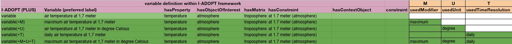
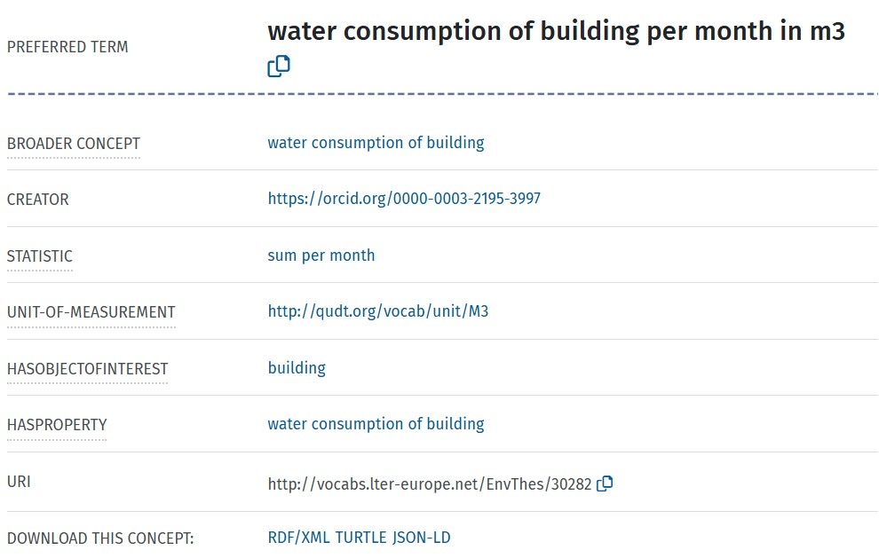
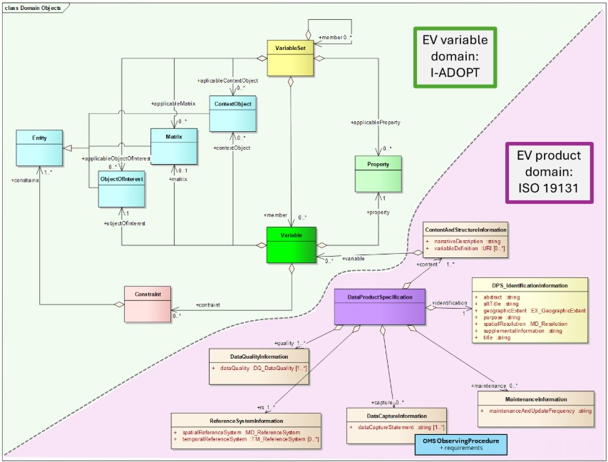

# Products - Variables with more context beyond I-ADOPT

* Status: proposed
* Date: 2025-02-24
* Discussion: [examples #13](https://github.com/i-adopt/examples/issues/13)

## Context

Suggestion on how to add additional description components as extensions of I-ADOPT variables. 

## Decision

*pending*

## Considered Options

### Option A: I-ADOPT extension

This approach would require to model a variable as a child of an existing I-ADOPT Variable as demonstrated in this EnvThes example [here](http://vocabs.lter-europe.net/EnvThes/30282). It is not possible to add these extensions (like statistical measures) as constraints, because these apply to the whole variable. 
In EnvThes we have added for now these extensions:
* https://w3id.org/env/puv#statistic for adding statistical measures
* https://w3id.org/env/puv#usesMethod for adding a method
* http://www.w3.org/ns/sosa/madeBySensor for adding the instrument and potentially, but not recommended
* https://w3id.org/env/puv#uom for adding the used unit

* **Pros**:
  * easy to implement
* **Cons**
  * not standardised which object properties should be used, but we could write guidelines
  * might lead potentially to an explosion of descriptions (especially true for units!)
  * method is part of the observation procedure and not intended to be included in I-ADOPT
  * semantically it is no more an I-ADOPT variable, so not clear if it can be modelled as a subconcept of an I-ADOPT variable in SKOS

### Option B: Complementing I-ADOPT with ISO 19131 

By using ISO 19131 - Data Product Specification (DPS), requirements for products description can be taken into account.

* **Pros**:
  * OMS ObservingProcedure (+ requirements) could be used to better describe the DataCaptureInformation from the DPS which intends to explain how the data needs to be captured.
  * EBV products can be easily created.
    
* **Cons**
  * what are the object properties that can be used for these relationships captured in the UML?
    
