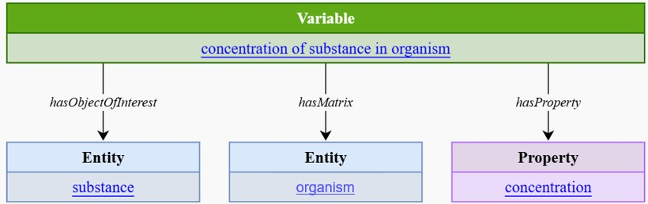

# Documentation of the used Patterns

* Status:  proposed
* Date: 2025-03-10
* Discussion:

## Context

The documentation of the pattern used might be useful for associating the logic used to decompose a variable with the actual variable description.

## Decision

*pending*

## Considered Options

### Option A: Pattern as abstract variable

The pattern is described as an abstract variable and published as a machine-readable representation.
It is retrievable via its persistent identifier.
A library of patterns is published centrally.
See e.g.:

* **Pros**:
  * helpful for the service development, as pattern is specifically stated
  * helpful for other implementers to understand how this was done
  * any variable description can be associated to a specific pattern
  * it is helpful to create automatic mappings between patterns
* **Cons**
  * additional object property needed

#### Option A1: Linking to an abstract variable with I-ADOPT

Option A requires to provide an additional object property. This option would need an additional I-ADOPT object property

* **Pros**:
  * it is easy findable and reusable for developers and other implementers
* **Cons**
  * additional object property needed
 
 #### Option A2: Linking to an abstract variable outside I-ADOPT

Option A requires to provide an additional object property. This option would need an additional RDF statement that links the variable with the pattern

* **Pros**:
  * we do not need to add any additional property but could reuse external object properties
* **Cons**
  * these linkage is hard to find and reuse

### Option B: Using sub-properties instead of pattern descriptions

The pattern is translated into subproperties, like `hasSolute` for `hasObjectOfInterest` or `hasSolvent` for `hasMatrix`.

* **Pros**:
  * Existing queries keep working
* **Cons**
  * Requires possibly a large number of additional properties

### Option C: Describe in skos:notion the pattern

The pattern is described in the notion field of the `Variable` as simple text.

* **Pros**:
  * Easy to implement
* **Cons**
  * Hard to automatically use in a query
  * Not machine-readable
