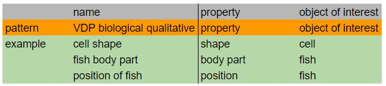

# VDP Biological Quantitative Variable

Biological quantitave variables are constituted by only the **property** and the **object of interest**, where the property is the broader term of the variable itself.

