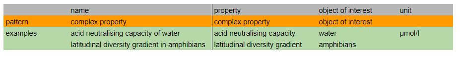

# VDP Complex Property
Complex properties have properties with long lables containing more than one term. A further decomposition would make the property meaningless. The unit of the values with which the variable is expressed should guide how far a further decomposition makes sense.

