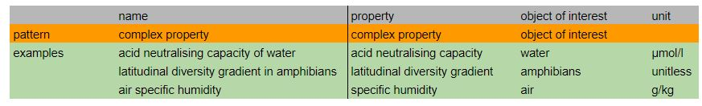

# VDP Complex Property
Variables with this pattern are constituted at least by a complex property and an object of Interest. Complex Properties are composed by more than one term and it would not make sense to further decompose them without loosing their original meaning. The units of the value used to express the variable can help to deduce the property at the right decomposition level. 

