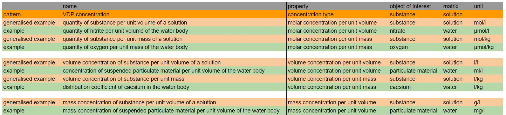

# VDP Concentration
Variables with this pattern are constituted at least by a property, an object of interest and most commonly also by a matrix. The pattern describes the amount of a specified substance in a unit amount of another substance or matrix. The units are attached here to demonstrate that there might be different combinations depending of the concentration types. We distinguish molar concentration (= quantity of substance), volume concentration and mass concentration. 

A specific case of mass concentration is density, which does not involve any matrix. 

